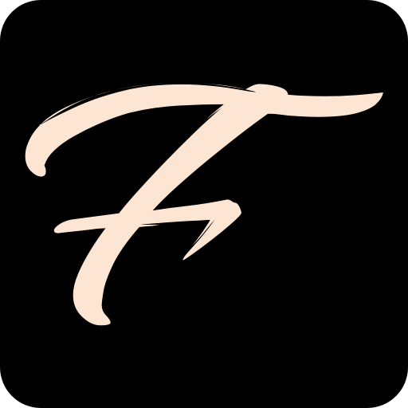

## Flow Fields <a href="https://flow-field-abdul-k.vercel.app/" target="_blank"> 🡭 </a>

  Flow Fields are used in generative art to create interesting trajectories/shapes/curves using <i>Vectors</i> to control the flow of particles in a given space.
  Here I have used the <i>Perlin Noise</i> function to achieve pseudo randomness for particle position.
  The tool is made using <b>p5js</b> library <a href="https://p5js.org/" target="_blank"> 🡭 </a> and it's inspired from this video series
  <a href="https://www.youtube.com/watch?v=Qf4dIN99e2w&list=PLRqwX-V7Uu6bgPNQAdxQZpJuJCjeOr7VD" target="_blank"> 🡭 </a>

## Examples

## Contribution
The project is open to feature suggestion or contribution, just raise an issue!

